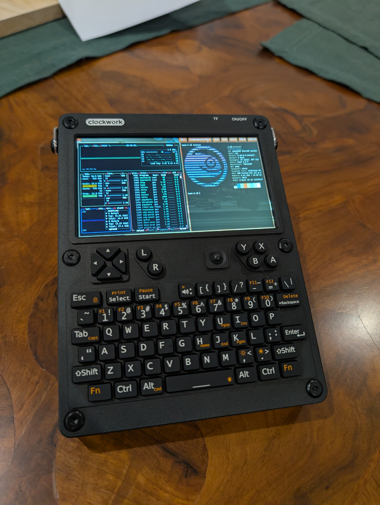

# uConsole CM5 on openSUSE MicroOS



This repository contains the drivers, device tree overlays, and configuration scripts required to run **openSUSE MicroOS** on the **ClockworkPi uConsole CM5** (Raspberry Pi Compute Module 5). It addresses critical hardware-specific issues including display voltage, power management, and driver instability.

## System Status

| Feature | Status | Fix Details |
|---------|--------|-------------|
| **Display** | ✅ Stable | **Pin Swap Overlay:** Forces driver to use correct reset logic. **Voltage:** Set to 3.3V (`aldo2`). |
| **Backlight** | ✅ Working | patched driver handles initialization logic. |
| **Power Button (Hold)** | ✅ Working | Hardware Hard-Off set to **4 Seconds** via PMIC register. |
| **Power Button (Tap)** | ❌ Disabled | Disabled due to hardware IRQ stuck-high fault on this unit. |
| **Shutdown** | ✅ Safe | Custom script forces PMIC shutdown via I2C, preventing regulator crashes. |
| **Boot Reliability** | ✅ Stable | BTRFS maintenance timers masked to prevent I/O storms and display underflows. |

## Installation (Fresh Install)

Follow these steps to set up a new openSUSE MicroOS installation on the uConsole CM5.

### 1. Prepare the OS
1.  Flash the **openSUSE MicroOS (aarch64)** image to your CM5 eMMC or SD card.
2.  Boot the device. Connect a USB keyboard/mouse and HDMI display if the internal screen is not yet working.
3.  Connect to Wi-Fi/Ethernet.
4.  Enable SSH: `sudo systemctl enable --now sshd`.

### 2. Prepare the Host
On your computer (Linux/macOS), clone this repository:
```bash
git clone https://github.com/GeoDerp/uconsole-cm5-opensuse-microos.git
cd uconsole-cm5-opensuse-microos
```

### 3. Deploy Configuration & Overlays
Run the deployment script to install the device tree overlays and base configuration. This fixes the display voltage and pinout.
```bash
# Replace 'user' and 'ip' with your device's details
./scripts/deploy_overlays_to_device.sh user@ip --names clockworkpi-uconsole-cm5
```
*The device will reboot.*

### 4. Build & Install Drivers
Run the driver build script. This compiles the custom kernel modules (`panel-cwu50`, `ocp8178_bl`, `drm-rp1-dsi`) on the device to match the running kernel.
```bash
./scripts/deploy_and_build_drivers_snapshot.sh user@ip
```
*The device will reboot again.*

### 5. Deploy Power Management & Services
Copy the critical power management scripts and enable the necessary services.
```bash
# Copy scripts
scp overlay/usr/local/sbin/* user@ip:/usr/local/sbin/
scp overlay/usr/local/bin/uconsole-backlight-init.sh user@ip:/usr/local/bin/

# Copy service files
scp overlay/etc/systemd/system/axp221-monitor.service user@ip:/etc/systemd/system/
scp overlay/etc/systemd/logind.conf.d/uconsole-power.conf user@ip:/etc/systemd/logind.conf.d/

# Enable services
ssh user@ip "sudo chmod +x /usr/local/sbin/*.sh /usr/local/bin/*.sh"
ssh user@ip "sudo restorecon -v /usr/local/sbin/* /usr/local/bin/*"
ssh user@ip "sudo systemctl daemon-reload"
ssh user@ip "sudo systemctl enable axp221-configure-pek.service uconsole-backlight.service"
# Note: axp221-monitor.service is disabled by default due to hardware IRQ issues on some units.
```

### 6. Configure User Session (Sway)
MicroOS boots to a TTY by default. Configure Sway to start automatically upon login.
```bash
# Copy Sway user service
ssh user@ip "mkdir -p ~/.config/systemd/user/"
scp overlay/home/geo/.config/systemd/user/sway.service user@ip:~/.config/systemd/user/

# Enable service
ssh user@ip "systemctl --user enable sway.service"
```

### 7. Finalize
Reboot the device.
1.  Log in at the TTY prompt.
2.  Sway should start automatically.
3.  The screen should be active and backlight adjustable.


## Troubleshooting & Safety

### 🛑 Boot Loop Recovery
If the device shuts down immediately after boot (Power Button Monitor false positive):
1.  Connect a USB keyboard.
2.  Power on and hold `Shift` or press `Esc` to access GRUB.
3.  Edit the boot entry: Add `systemd.unit=rescue.target`.
4.  Boot (F10).
5.  Disable the monitor: `systemctl disable axp221-monitor.service`.

### 📺 Black Screen
*   **Locked:** The screen is likely just locked by Swaylock. Type your password and press Enter.
*   **Backlight Off:** If `dmesg` says backlight is on but screen is dark, reload the driver: `sudo rmmod ocp8178_bl && sudo modprobe ocp8178_bl`.

## Lessons Learnt & Architecture

### 1. Display Reset Race Condition
**Problem:** The `panel-cwu50` driver toggles the Reset pin too early during boot, while the 3.3V regulator is still ramping up. The panel ignores this "weak" reset and fails to initialize.
**Solution:** We implemented a **GPIO Pin Swap** in the Device Tree. We mapped the "ID Pin" to the real Hardware Reset pin and pulled it LOW. This forces the driver into "Old Panel" detection mode, which triggers a specific toggle sequence on the "ID Pin" (actually the Reset Pin). This alternative sequence proves physically robust on every boot.

### 2. PMIC Interrupt Latching (The Boot Loop)
**Problem:** Pressing the power button to turn *on* the device latches the "Short Press" interrupt bit in the AXP221 PMIC. On some units, this bit gets stuck HIGH (`0xFF` readback), causing the monitoring script to think the button is constantly pressed.
**Solution:** The `axp221-monitor.sh` script implements a safety check. If it cannot clear the IRQ on startup, it **exits** instead of entering the monitoring loop. This prevents the infinite reboot cycle, but disables the "Tap" functionality.

### 3. Driver Unbind Crash
**Problem:** The standard `shutdown` command attempts to unbind device drivers. Unbinding the AXP20x I2C driver kills all child regulators immediately, cutting power to the CPU/RAM before the filesystem syncs.
**Solution:** The `axp221-poweroff.sh` script uses `i2cset -f` (Force Mode) to write the shutdown command directly to the PMIC *without* unbinding the driver. This maintains system power stability until the very last moment.


## Known Limitations

*   **Reboot Behavior:** The `reboot` command may fully power off the device instead of restarting it. This is a behavior of the AXP221 PMIC integration on this board. You must press the power button to turn it back on.
*   **Startup Sequence:** The device boots to a **TTY Login Prompt** (text mode). You must log in (user: `geo`) to automatically start the graphical interface (Sway).
*   **Sleep/Hibernate:** **Not Supported.**
    *   **Sleep:** Fails due to missing RTC driver (`/dev/rtc0` not found).
    *   **Hibernate:** Fails due to no Swap space configured.
    *   *Workaround:* Use **Shutdown** (Power Off) to save battery. Boot time is fast.

## Todo
- [ ] smooth out trackball

## Credits
- **Rex & The ClockworkPi Community:** For the initial CM5 hardware investigation and device tree overlays.
- **ClockworkPi:** For the uConsole hardware.
- **openSUSE:** For the MicroOS platform.
- **Raspberry Pi:** For the RP1 drivers and CM5 support.

## License
The scripts and configurations in this repository are open source.
The kernel drivers in `extracted-drivers/` are derived from the Linux Kernel and Raspberry Pi kernel source, licensed under **GPL-2.0-or-later**.