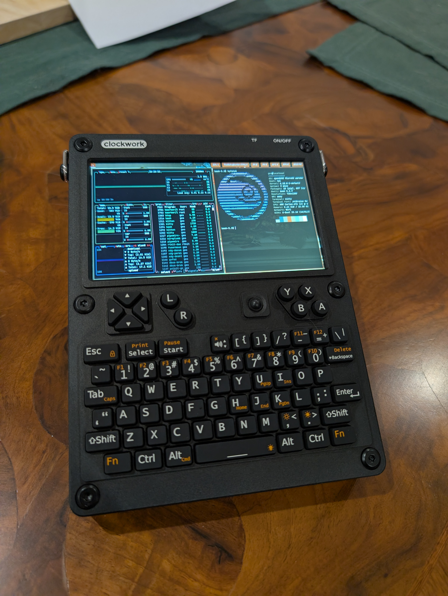

# uConsole CM5 on openSUSE MicroOS



This repository provides the definitive drivers, device tree overlays, and automated configuration scripts required to run **openSUSE MicroOS** reliably on the **ClockworkPi uConsole CM5** (Raspberry Pi Compute Module 5). It resolves critical hardware-specific issues including display flickering, power management locks, driver symbol mismatches, and battery monitoring.

## System Status (March 2026)

| Feature | Status | Fix Details |
|---------|--------|-------------|
| **Display** | ✅ Stable | Hardcoded landscape rotation. DSI pixel clock locked at a safe 40MHz (by removing GRUB VESA overrides) to permanently eliminate Underflow errors and flickering. |
| **Graphics**| ✅ Hardware | Standard `vc4` DRM active. Boot screen shows TTY before handing off to Sway/Wayland seamlessly. |
| **Audio**   | ✅ Working | Speakers functional via `snd_soc_rp1_aout`. Drivers rebuilt against current kernel. |
| **Battery Fuel Gauge** | ✅ Functional | OpenSUSE lacks the `axp22x_cells` MFD patch. We inject `uconsole_fixup` to bind to the AXP221 PMIC via I2C address `0x34` to expose the battery sysfs. |
| **Input (Keyboard/Trackball)**   | ✅ Working | `dwc2` driver forced to `host` mode. Aggressive VBUS hogs removed to prevent PMIC over-current trips on cold boot. |
| **External USB-A Port**   | ✅ Working | Powered by the same internal hub as the keyboard. |
| **Power Button** | ⚠️ Limited | Physical 6s hold shuts down. "Tap" polling is managed by `axp221-monitor.sh` but can be disabled if hardware interrupts stick. |
| **Shutdown** | ✅ Aggressive | Forced PMIC shutdown via direct I2C writes (`axp221-poweroff.sh`) unbinds drivers first to bypass persistent I2C bus locks. |
| **Battery Safety**| ✅ Active | Background monitor (`uconsole-power-monitor`) broadcasts warnings to TTY/Wayland at **15%**, and forces a hardware shutdown at **8%** to prevent the PMIC from entering a brownout/zombie state. |
| **MicroSD Slot** | ❌ Not Working | External SD card slot on the mainboard is currently undetected by the RP1 architecture. |
| **Sleep / Hibernate** | ❌ Not Supported | **Sleep:** Fails due to missing deep sleep ACPI support on XHCI. **Hibernate:** Fails due to no Swap space. <br>✅ *Alternative*: System automatically powers off after **30 minutes** of screen inactivity to preserve battery. |

---

## Installation (Fresh Install)

Follow these steps to set up a new openSUSE MicroOS installation on the uConsole CM5. Our deployment script is fully automated and "Self-Healing"—it natively recompiles all custom drivers against whatever kernel MicroOS has installed.

### 1. Prepare the OS
1.  Flash the **openSUSE MicroOS (aarch64)** image to your CM5 eMMC or an SD card (using a CM4 IO board or RPi Imager).
2.  Boot the device. Connect a USB keyboard/mouse and external display if needed.
3.  Connect to Wi-Fi/Ethernet.
4.  Enable SSH: `sudo systemctl enable --now sshd`.

### 2. Prepare the Host
On your computer (Linux/macOS), clone this repository:
```bash
git clone https://github.com/GeoDerp/uconsole-cm5-opensuse-microos.git
cd uconsole-cm5-opensuse-microos
```

### 3. The "One-Click" Deployment
Run the master stabilization script. This script will:
*   Compile the customized device tree overlay.
*   Sync the C source code for all uConsole drivers to the device.
*   Extract the kernel headers (`vmlinux`) from the active MicroOS snapshot.
*   **Compile all out-of-tree drivers natively on the device** (fixing symbol version mismatch errors).
*   Install the power management scripts and configure GRUB.

```bash
# Replace user@192.168.1.100 with your user and device IP
./scripts/deploy_stabilized_config.sh user@192.168.1.100
```

### 4. Reboot and Finalize
The script will instruct you to reboot. Because MicroOS uses transactional updates, you must restart for the changes to take effect.
```bash
ssh user@192.168.1.100 "sudo reboot"
```
*Note: If the system hangs during shutdown (green LED stays on), the PMIC is locked. Perform a 60-second battery pull (see Troubleshooting below).*

---

## Critical Troubleshooting

### 🧟 The "Zombie PMIC" (Hardware Over-Current Lock)
**Symptom**: The green LED stays on but the screen is dead, the device ignores `reboot`/`poweroff` commands, OR the keyboard suddenly dies and `dmesg` floods with `usb x-portx: over-current condition`.
**Cause**: If the battery drops too low (~3.4V) under load, the AXP221 PMIC trips a physical, analog safety latch that cuts power to the USB hub. Because it's a hardware latch, the chip's state machine freezes and stops accepting software I2C commands.
**The Fix**: **A 60-Second Battery Pull.**
1. Unplug the USB-C charger.
2. Remove BOTH batteries.
3. Wait at least 60 seconds (The green LED must be completely dark to drain the capacitors).
4. Re-insert and power on. Software cannot "un-blow" this fuse; it must lose voltage entirely.

### ⏳ The "Fake" 11-Day Uptime
**Symptom**: Immediately after a fresh boot, `uptime` reports 11, 12, or 26 days.
**Cause**: The CM5 lacks a battery-backed Real Time Clock (RTC). The kernel boots using the Unix epoch (1970) or a historic timestamp saved by systemd. When the network connects, NTP immediately jumps the system clock forward to the present day. This sudden "time travel" confuses the kernel's uptime calculation. **This is expected behavior and is not a bug.**

### 🛠️ Kernel Updates (Transactional Updates)
When openSUSE automatically updates the system kernel via `transactional-update`, your display and battery drivers will instantly break on the next boot because the kernel ABI symbols changed.
**The Fix**: Simply run `./scripts/deploy_stabilized_config.sh` again from your host machine. The script is designed to automatically detect the new kernel, recompile all drivers from source against the new headers, and drop them into the overlay folder.

## License
The scripts and configurations in this repository are open source.
The kernel drivers in `extracted-drivers/` are derived from the Linux Kernel and Raspberry Pi kernel source, licensed under **GPL-2.0-or-later**.
